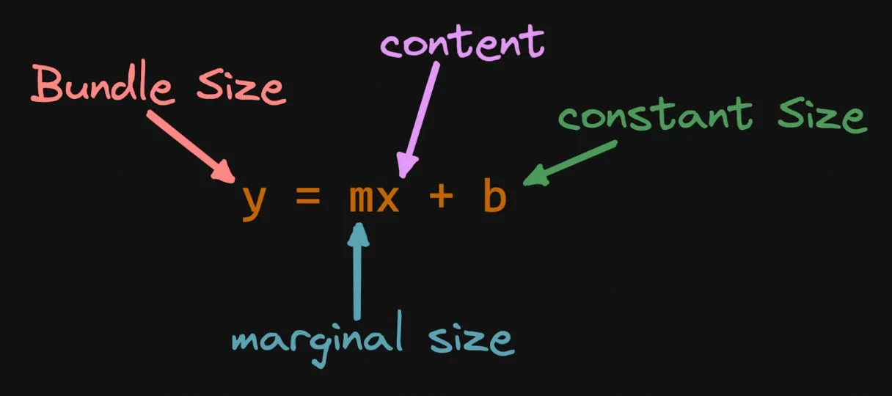
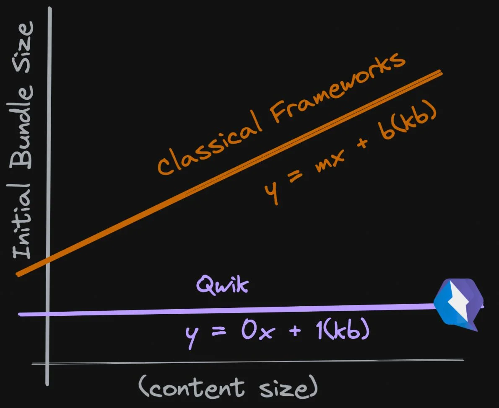
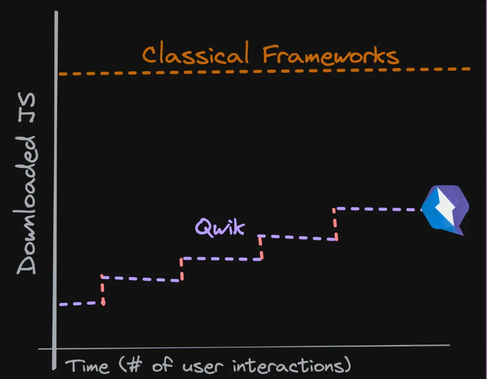
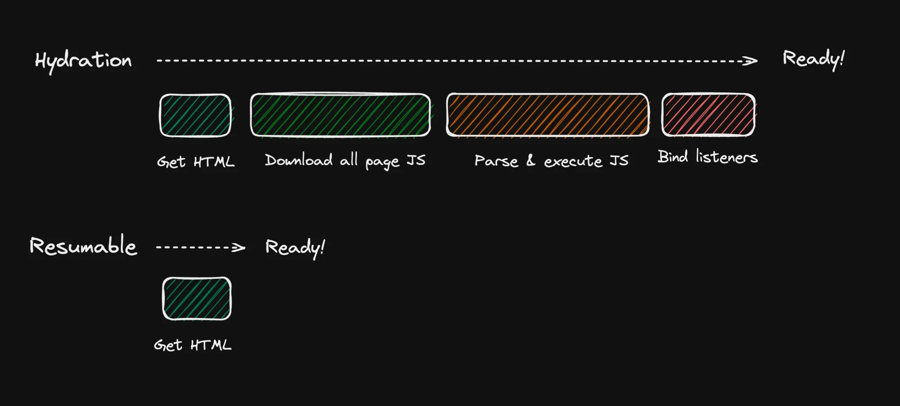
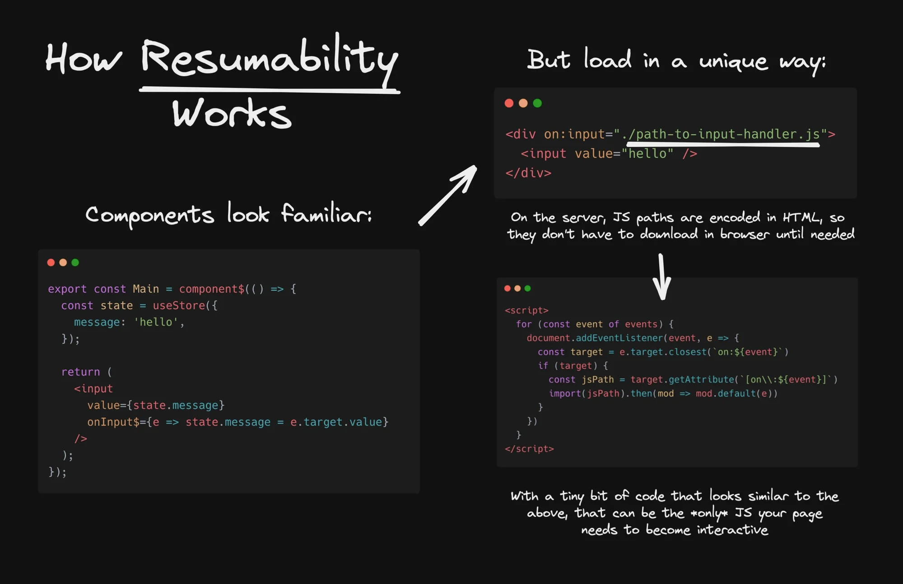

## Qwik with Qwik City - resumable, progressive web framework 
### Tomasz Ścisło, 02.12.2022

**Qwik** is a new kind of web framework that can deliver instant loading web applications at any size or complexity. 

_Qwik is like React_, so it knows how to render and manage the tree of components

_Qwik City is like Next.js_, so it is a fully opinionated web framework with Qwik as rendering library

### Why Qwik is unique?
Qwik is unique because of time to interactive performance.

### How does the browser handle JS code in React or Angular that served from the server?
1. Since JS is single threaded the browser needs to download first HTML (blank page, or some Loading... static text)
2. Downloads JS files
3. The main.js file is being parsed and interpreted
4. Hydration happens (event listeners are hooked and component boundaries are set)
5. Page becomes interactive.

### Howe does is look for Qwik?
1. HTML prefilled with serialized state of the application is being downloaded [resumable]
2. Qwik loader is downloaded and parsed (1kB)
3. Application is interactive
4. More app bundles are downloaded by service workers if needed (separate threads) but even those are not interpreted before they are needed [progressive]

#### Bundle size
**Main bundle size of classic framework** in general is function that **depends on application complexity** (number of interactions, external libraries, etc.)

**Main bundle size of ANY application in Qwik** is constant as it **DOES NOT depend on application complexity**

#### Progressives
Qwik aim is to ship to the browser main JS thread as little JS code as possible for it to parse and interpret. Everything else is either lazy loaded or prefetched while user already interacts with the app.

**What, wait Angular and React also do lazy loading...**
Well in fact the only thing they can do is lazy load code that corresponds with the functionality that is not visible on the current page. Qwik can do exactly the same but for the components that are already rendered.

#### Resumability vs Hydration

**Resumability** is about pausing execution in the server and resuming execution in the client without having to replay and download all of the application logic.

A good mental model is that Qwik applications at any point in their lifecycle can be serialized and moved to a different VM instance (server to browser). There, the application simply resumes where the serialization stopped. No hydration is required. This is why we say that Qwik applications don't hydrate; they resume.

(*) Tradeoffs of Resumability

This necessitates that applications are written with resumability constraints in mind. It is simply not possible for developers to continue to write applications in a heap-centric way and expect that a better framework can somehow make up for this sub-optimal approach.

### Demos
1. Qwik: https://qwik.azurewebsites.net/
2. React: https://hello-react.azurewebsites.net/
3. Qwik: https://www.builder.io/
4. Next.js (SSG): https://www.builder.io/?render=next

### Time to interactive
https://pagespeed.web.dev/report?url=https%3A%2F%2Fqwik.azurewebsites.net%2Freact-basic

https://pagespeed.web.dev/report?url=https%3A%2F%2Fhello-react.azurewebsites.net%2F

Sources
* https://qwik.builder.io/
* https://www.builder.io/blog/our-current-frameworks-are-on-we-need-o1
* https://www.builder.io/blog/hydration-is-pure-overhead
